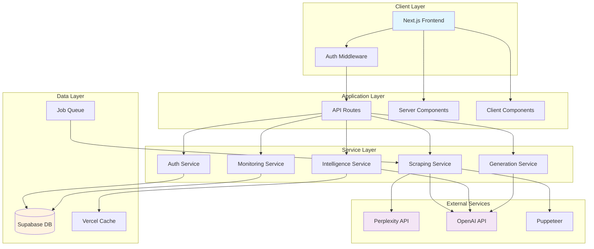
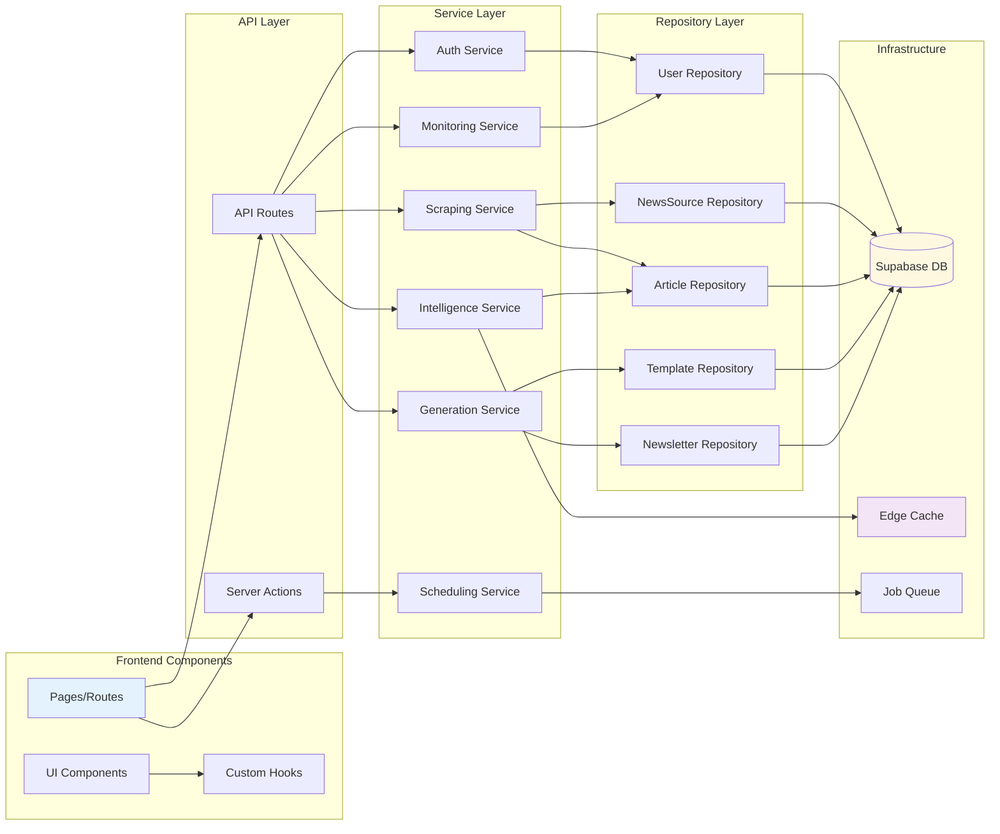
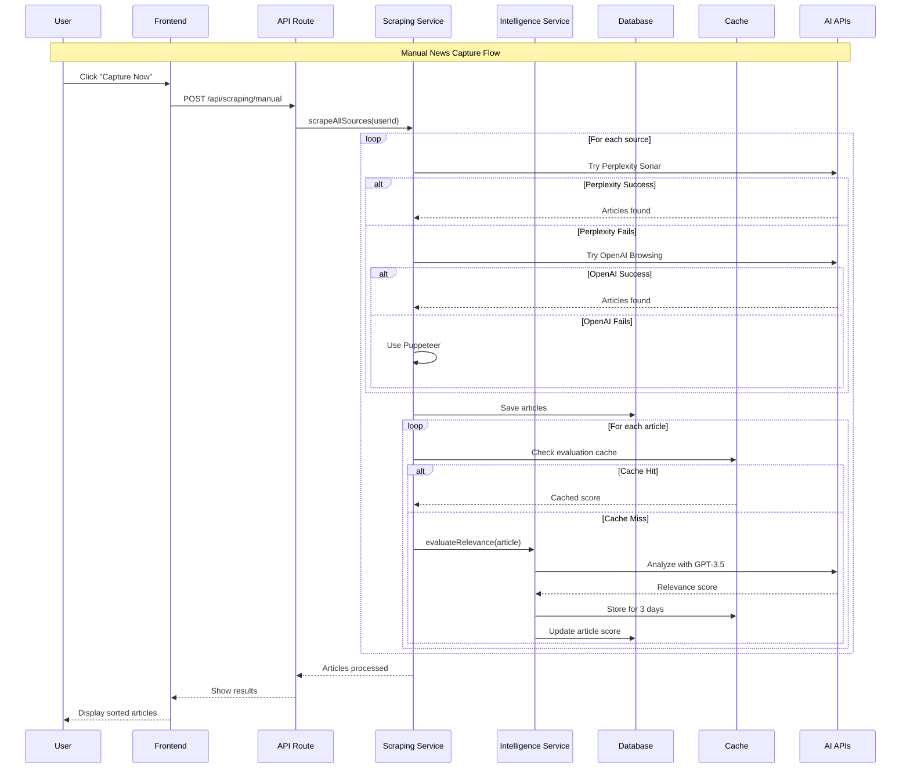
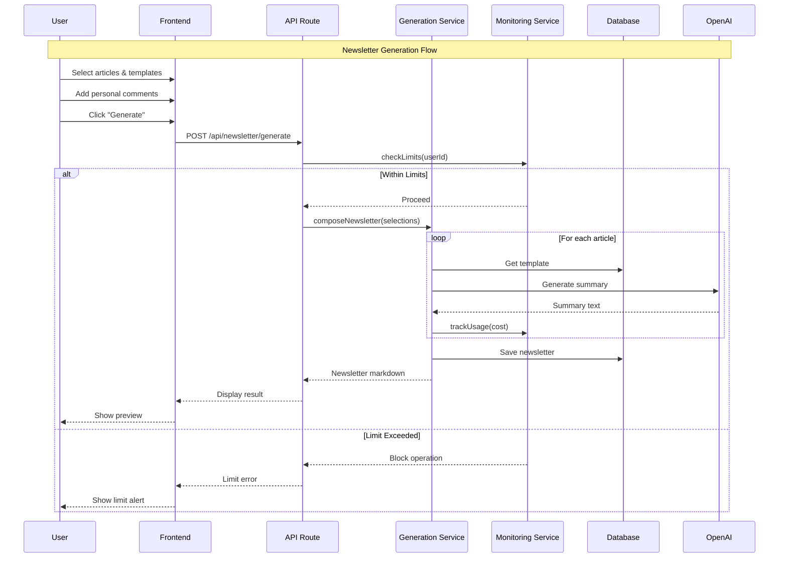

## Architecture Document - Newsletter Creator (Completo)

Vou gerar o documento completo de arquitetura para você exportar:

---

# Newsletter Creator - Architecture Document

## Introduction

Este documento define a arquitetura completa para o Newsletter Creator, um sistema de criação automatizada de newsletters com curadoria híbrida (IA + humana). A arquitetura é projetada para ser escalável, resiliente e otimizada para custos, utilizando a stack Next.js + Supabase + Vercel.

**Relationship to Frontend Architecture:**
Como este é um projeto full-stack com interface significativa, aspectos específicos de frontend serão detalhados em documento separado. As escolhas tecnológicas aqui definidas são definitivas para todo o projeto.

### Starter Template or Existing Project

**Decisão**: Utilizar o starter oficial Next.js + Supabase

```bash
npx create-next-app -e with-supabase
```

Documentação: https://supabase.com/docs/guides/getting-started/quickstarts/nextjs

Este starter fornece:

- Configuração completa de autenticação com Supabase
- Middleware de autenticação configurado
- Cliente Supabase com TypeScript
- Server e Client Components otimizados
- Estrutura de projeto seguindo best practices

**Adaptações necessárias**:

- Adicionar Shadcn/UI ao projeto
- Configurar estrutura de features
- Implementar schema específico do Newsletter Creator

### Change Log

| Data       | Versão | Descrição                      | Autor   |
| ---------- | ------ | ------------------------------ | ------- |
| 2024-01-20 | 1.0    | Criação inicial da arquitetura | Winston |

## High Level Architecture

### Technical Summary

O Newsletter Creator é uma aplicação web moderna construída como um monolito modular utilizando Next.js 14+ com App Router. O sistema combina Server Components para renderização otimizada com Client Components para interatividade rica. A arquitetura prioriza performance através de cache inteligente, processamento assíncrono para operações pesadas, e uma estratégia de scraping em camadas que minimiza custos. O Supabase fornece autenticação, banco de dados e storage, enquanto Vercel oferece hosting otimizado com edge functions. A integração com APIs de IA (Perplexity e OpenAI) é gerenciada através de uma camada de abstração que permite fallback automático e controle granular de custos.

### High Level Overview

**Architectural Style**: Monolito Modular com arquitetura orientada a componentes
**Repository Structure**: Monorepo contendo toda a aplicação
**Service Architecture**: Aplicação única com módulos bem definidos:

- Módulo de Autenticação (Supabase Auth)
- Módulo de Captura (Scraping + IA)
- Módulo de Curadoria (Interface + Templates)
- Módulo de Geração (IA + Markdown)
- Módulo de Monitoramento (Custos + Agendamento)

**Primary Data Flow**:

1. Usuário configura fontes e agenda captura
2. Sistema executa scraping via Perplexity/OpenAI/Puppeteer
3. IA avalia relevância e ordena conteúdo
4. Usuário faz curadoria com templates personalizados
5. Sistema gera newsletter em Markdown

**Key Architectural Decisions**:

- Server-first approach para melhor SEO e performance
- Edge caching agressivo para conteúdo estático
- Queue system leve usando Vercel Cron + Supabase
- Rate limiting em múltiplas camadas
- Fallback strategy para alta disponibilidade

### High Level Project Diagram



### Architectural and Design Patterns

- **Server Components First**: Utilizar Server Components por padrão, Client Components apenas quando necessário - _Rationale:_ Melhor performance, menor bundle size, SEO otimizado
- **Repository Pattern**: Abstração de acesso a dados para todas as entidades - _Rationale:_ Facilita testes, permite mudança de storage, centraliza lógica de dados
- **Service Layer Pattern**: Lógica de negócio isolada em services - _Rationale:_ Separação de responsabilidades, reutilização, testabilidade
- **Strategy Pattern para Scraping**: Múltiplas implementações com fallback - _Rationale:_ Resiliência, otimização de custos, flexibilidade
- **Cache-Aside Pattern**: Cache de avaliações de IA e resultados - _Rationale:_ Redução drástica de custos, melhor performance
- **Circuit Breaker**: Para todas as integrações externas - _Rationale:_ Previne falhas em cascata, melhora resiliência
- **Rate Limiting Hierárquico**: Global → User → Operation - _Rationale:_ Controle fino de custos, prevenção de abuso
- **Event-Driven Updates**: Webhooks para notificações assíncronas - _Rationale:_ Melhor UX, desacoplamento

## Tech Stack

### Cloud Infrastructure

- **Provider:** Vercel (Frontend + Edge) + Supabase (Backend Services)
- **Key Services:** Vercel Hosting, Edge Functions, Cron Jobs, Supabase Auth, PostgreSQL, Realtime
- **Deployment Regions:** us-east-1 (primary), sa-east-1 (futuro)

### Technology Stack Table

| Category              | Technology       | Version  | Purpose                    | Rationale                                      |
| --------------------- | ---------------- | -------- | -------------------------- | ---------------------------------------------- |
| **Runtime**           | Node.js          | 20.x LTS | JavaScript runtime         | Estabilidade, performance, compatibilidade     |
| **Framework**         | Next.js          | 14.1+    | Full-stack React framework | App Router, Server Components, melhor DX       |
| **Language**          | TypeScript       | 5.3+     | Type-safe JavaScript       | Previne erros, melhor IDE support              |
| **UI Library**        | React            | 18.2+    | Component library          | Padrão de mercado, ecosistema rico             |
| **Component Library** | Shadcn/UI        | Latest   | UI components              | Componentes modernos, totalmente customizáveis |
| **Styling**           | Tailwind CSS     | 3.4+     | Utility-first CSS          | Produtividade, consistência, performance       |
| **Database**          | PostgreSQL       | 15+      | Primary database           | Via Supabase, ACID compliance, JSON support    |
| **ORM/Query**         | Supabase Client  | 2.38+    | Database client            | Type-safe, realtime, RLS integrado             |
| **Auth**              | Supabase Auth    | Latest   | Authentication             | Integrado, seguro, múltiplos providers         |
| **State Management**  | Zustand          | 4.4+     | Global state               | Simples, performático, TypeScript              |
| **Data Fetching**     | TanStack Query   | 5.17+    | Server state               | Cache inteligente, otimista updates            |
| **Form Handling**     | React Hook Form  | 7.48+    | Form management            | Performance, validação integrada               |
| **Validation**        | Zod              | 3.22+    | Schema validation          | Type inference, runtime validation             |
| **HTTP Client**       | Ky               | 1.2+     | API requests               | Moderno, retry automático, hooks               |
| **Testing**           | Jest             | 29+      | Unit/Integration tests     | Padrão de mercado, snapshot testing            |
| **Testing UI**        | Testing Library  | 14+      | Component testing          | Best practices, user-centric                   |
| **E2E Testing**       | Playwright       | 1.40+    | End-to-end tests           | Cross-browser, reliable, fast                  |
| **Scraping**          | Puppeteer        | 21+      | Web scraping fallback      | Headless Chrome, JavaScript support            |
| **AI Integration**    | OpenAI SDK       | 4.24+    | AI operations              | Official SDK, TypeScript support               |
| **Monitoring**        | Sentry           | 7.91+    | Error tracking             | Contexto rico, performance monitoring          |
| **Analytics**         | Vercel Analytics | Latest   | Web analytics              | Privacy-first, Core Web Vitals                 |
| **Linting**           | ESLint           | 8.56+    | Code linting               | Code quality, consistency                      |
| **Formatting**        | Prettier         | 3.2+     | Code formatting            | Consistent style, zero-config                  |
| **CI/CD**             | GitHub Actions   | N/A      | Automation                 | Integrado, free tier generoso                  |

## Data Models

### User

**Purpose:** Representa usuários autenticados do sistema
**Integration:** Gerenciado pelo Supabase Auth, estendido com profile

**Key Attributes:**

- id: UUID - ID único do Supabase Auth
- email: string - Email de autenticação
- created_at: timestamp - Data de criação
- subscription_tier: enum('free', 'pro') - Nível de assinatura
- api_limit_usd: decimal - Limite mensal em USD
- api_usage_usd: decimal - Uso atual do mês

**Relationships:**

- Has many NewsSource
- Has many Newsletter
- Has many Template

### NewsSource

**Purpose:** Fontes de notícias configuradas para monitoramento
**Integration:** Relacionado ao usuário que criou

**Key Attributes:**

- id: UUID - Identificador único
- user_id: UUID - Referência ao usuário
- name: string - Nome da fonte
- url: string - URL base do site
- description: text - Descrição do conteúdo
- tags: string[] - Tags para categorização
- is_active: boolean - Se está ativa para scraping
- last_scraped_at: timestamp - Última execução
- created_at: timestamp - Data de criação

**Relationships:**

- Belongs to User
- Has many Article

### Article

**Purpose:** Notícias capturadas das fontes
**Integration:** Cache de 3 dias, depois soft delete

**Key Attributes:**

- id: UUID - Identificador único
- source_id: UUID - Referência à fonte
- title: string - Título da notícia
- url: string - Link original
- content: text - Conteúdo capturado
- image_url: string - URL da imagem principal
- ai_score: decimal(3,1) - Nota de relevância (0-10)
- ai_evaluation: jsonb - Detalhes da avaliação
- scraped_at: timestamp - Momento da captura
- cached_until: timestamp - Validade do cache

**Relationships:**

- Belongs to NewsSource
- Belongs to many Newsletter (via NewsletterArticle)

### Template

**Purpose:** Templates de resumo personalizados
**Integration:** Usado na geração de conteúdo

**Key Attributes:**

- id: UUID - Identificador único
- user_id: UUID - Referência ao usuário
- name: string - Nome do template
- description: text - Descrição de uso
- prompt: text - Prompt para IA
- is_default: boolean - Se é o template padrão
- created_at: timestamp - Data de criação

**Relationships:**

- Belongs to User
- Used by NewsletterArticle

### Newsletter

**Purpose:** Newsletters criadas pelo usuário
**Integration:** Produto final do sistema

**Key Attributes:**

- id: UUID - Identificador único
- user_id: UUID - Referência ao usuário
- title: string - Título gerado
- markdown_content: text - Conteúdo em Markdown
- generation_cost_usd: decimal - Custo de geração
- created_at: timestamp - Data de criação

**Relationships:**

- Belongs to User
- Has many NewsletterArticle

### NewsletterArticle

**Purpose:** Relação entre newsletter e artigos com personalização
**Integration:** Join table com dados adicionais

**Key Attributes:**

- newsletter_id: UUID - Referência à newsletter
- article_id: UUID - Referência ao artigo
- template_id: UUID - Template usado
- summary_size: enum('S','M','L') - Tamanho do resumo
- user_comment: text - Comentário pessoal
- position: integer - Ordem na newsletter
- generated_summary: text - Resumo gerado

**Relationships:**

- Belongs to Newsletter
- Belongs to Article
- Uses Template

## Components

### Authentication Service

**Responsibility:** Gerenciar autenticação, autorização e sessões de usuário

**Key Interfaces:**

- signUp(email, password): Criar nova conta
- signIn(email, password): Autenticar usuário
- signOut(): Encerrar sessão
- resetPassword(email): Iniciar reset de senha
- getSession(): Obter sessão atual

**Dependencies:** Supabase Auth

**Technology Stack:** Supabase Auth + Next.js Middleware

### Scraping Service

**Responsibility:** Capturar notícias de fontes configuradas usando estratégia em camadas

**Key Interfaces:**

- scrapeWithPerplexity(source): Tentar via Perplexity
- scrapeWithOpenAI(source): Fallback para OpenAI
- scrapeWithPuppeteer(source): Último recurso
- scrapeAllSources(userId): Processar todas as fontes

**Dependencies:** NewsSource Repository, Article Repository, External APIs

**Technology Stack:** APIs externas + Puppeteer

### Intelligence Service

**Responsibility:** Avaliar relevância de notícias e gerar scores

**Key Interfaces:**

- evaluateRelevance(article, tags): Calcular score 0-10
- checkCache(articleUrl): Verificar cache de 3 dias
- batchEvaluate(articles): Processar múltiplos
- getEvaluationCost(): Calcular custo

**Dependencies:** Article Repository, Cache Service, OpenAI

**Technology Stack:** OpenAI API + Vercel Edge Cache

### Generation Service

**Responsibility:** Gerar newsletters em Markdown usando templates e IA

**Key Interfaces:**

- generateSummary(article, template, size, comment): Criar resumo
- composeNewsletter(selections): Montar newsletter completa
- calculateCost(selections): Prever custo
- formatMarkdown(content): Formatar saída

**Dependencies:** Template Repository, OpenAI

**Technology Stack:** OpenAI API + Markdown processing

### Monitoring Service

**Responsibility:** Rastrear uso de API, custos e limites

**Key Interfaces:**

- trackUsage(userId, cost, operation): Registrar uso
- checkLimits(userId): Verificar limites
- getUserUsage(userId): Obter consumo atual
- getUsageHistory(userId, period): Histórico
- sendAlerts(userId, threshold): Notificar limites

**Dependencies:** User Repository, Notification Service

**Technology Stack:** Supabase Realtime + Edge Functions

### Scheduling Service

**Responsibility:** Gerenciar agendamentos de scraping automático

**Key Interfaces:**

- scheduleJob(userId, cronExpression): Criar agendamento
- executeScheduledJobs(): Processar jobs pendentes
- getNextRun(userId): Próxima execução
- toggleSchedule(userId, enabled): Ativar/desativar

**Dependencies:** Scraping Service, User Repository

**Technology Stack:** Vercel Cron Jobs + Supabase

### Component Diagrams



## External APIs

### Perplexity Sonar API

- **Purpose:** Buscar e capturar notícias com contexto inteligente
- **Documentation:** https://docs.perplexity.ai/reference/sonar-api
- **Base URL(s):** https://api.perplexity.ai
- **Authentication:** Bearer Token (API Key)
- **Rate Limits:** 50 requests/minute (Pro plan)

**Key Endpoints Used:**

- `POST /chat/completions` - Buscar notícias com web search

**Integration Notes:** Primeira opção para scraping por qualidade e custo. Implementar retry com backoff exponencial.

### OpenAI API

- **Purpose:** Fallback para scraping via browsing, avaliação de relevância e geração de resumos
- **Documentation:** https://platform.openai.com/docs
- **Base URL(s):** https://api.openai.com/v1
- **Authentication:** Bearer Token (API Key)
- **Rate Limits:** Baseado em tier da conta

**Key Endpoints Used:**

- `POST /chat/completions` - Browsing, avaliação e geração
- `GET /usage` - Monitorar consumo

**Integration Notes:** Cache agressivo para reduzir custos. Usar modelos menores para avaliação (gpt-3.5) e maiores para geração (gpt-4).

## Core Workflows

### Manual News Capture Flow



### Newsletter Generation Flow



## REST API Spec

```yaml
openapi: 3.0.0
info:
  title: Newsletter Creator API
  version: 1.0.0
  description: API para criação automatizada de newsletters
servers:
  - url: https://api.newslettercreator.com.br
    description: Production server
  - url: http://localhost:3000
    description: Development server

paths:
  /api/auth/signup:
    post:
      summary: Create new user account
      requestBody:
        required: true
        content:
          application/json:
            schema:
              type: object
              properties:
                email:
                  type: string
                  format: email
                password:
                  type: string
                  minLength: 8
      responses:
        201:
          description: User created successfully
        400:
          description: Invalid input
        409:
          description: Email already exists

  /api/sources:
    get:
      summary: List user's news sources
      security:
        - bearerAuth: []
      responses:
        200:
          description: List of sources
          content:
            application/json:
              schema:
                type: array
                items:
                  $ref: "#/components/schemas/NewsSource"

    post:
      summary: Add new news source
      security:
        - bearerAuth: []
      requestBody:
        required: true
        content:
          application/json:
            schema:
              type: object
              properties:
                name:
                  type: string
                url:
                  type: string
                  format: uri
                description:
                  type: string
                tags:
                  type: array
                  items:
                    type: string
      responses:
        201:
          description: Source created
        400:
          description: Invalid URL or scraping failed

  /api/scraping/manual:
    post:
      summary: Trigger manual news capture
      security:
        - bearerAuth: []
      responses:
        200:
          description: Scraping completed
          content:
            application/json:
              schema:
                type: object
                properties:
                  articlesFound:
                    type: integer
                  articlesScored:
                    type: integer
                  errors:
                    type: array
                    items:
                      type: string
        429:
          description: Rate limit exceeded

  /api/articles:
    get:
      summary: Get captured articles
      security:
        - bearerAuth: []
      parameters:
        - in: query
          name: sourceId
          schema:
            type: string
          required: false
        - in: query
          name: minScore
          schema:
            type: number
          required: false
      responses:
        200:
          description: List of articles
          content:
            application/json:
              schema:
                type: array
                items:
                  $ref: "#/components/schemas/Article"

  /api/templates:
    get:
      summary: List user's templates
      security:
        - bearerAuth: []
      responses:
        200:
          description: List of templates

    post:
      summary: Create new template
      security:
        - bearerAuth: []
      requestBody:
        required: true
        content:
          application/json:
            schema:
              $ref: "#/components/schemas/Template"
      responses:
        201:
          description: Template created

  /api/newsletter/generate:
    post:
      summary: Generate newsletter
      security:
        - bearerAuth: []
      requestBody:
        required: true
        content:
          application/json:
            schema:
              type: object
              properties:
                articles:
                  type: array
                  items:
                    type: object
                    properties:
                      articleId:
                        type: string
                      templateId:
                        type: string
                      summarySize:
                        type: string
                        enum: [S, M, L]
                      userComment:
                        type: string
      responses:
        200:
          description: Newsletter generated
          content:
            application/json:
              schema:
                type: object
                properties:
                  id:
                    type: string
                  markdown:
                    type: string
                  cost:
                    type: number
        402:
          description: API limit exceeded

  /api/monitoring/usage:
    get:
      summary: Get current month usage
      security:
        - bearerAuth: []
      responses:
        200:
          description: Usage data
          content:
            application/json:
              schema:
                type: object
                properties:
                  currentUsageUSD:
                    type: number
                  limitUSD:
                    type: number
                  percentageUsed:
                    type: number

components:
  schemas:
    NewsSource:
      type: object
      properties:
        id:
          type: string
        name:
          type: string
        url:
          type: string
        description:
          type: string
        tags:
          type: array
          items:
            type: string
        isActive:
          type: boolean
        lastScrapedAt:
          type: string
          format: date-time

    Article:
      type: object
      properties:
        id:
          type: string
        title:
          type: string
        url:
          type: string
        imageUrl:
          type: string
        aiScore:
          type: number
        source:
          $ref: "#/components/schemas/NewsSource"
        scrapedAt:
          type: string
          format: date-time

    Template:
      type: object
      properties:
        id:
          type: string
        name:
          type: string
        description:
          type: string
        prompt:
          type: string
        isDefault:
          type: boolean

  securitySchemes:
    bearerAuth:
      type: http
      scheme: bearer
```

## Database Schema

```sql
-- Enable UUID extension
CREATE EXTENSION IF NOT EXISTS "uuid-ossp";

-- Users table (managed by Supabase Auth)
-- Extended with profile information
CREATE TABLE public.user_profiles (
    id UUID REFERENCES auth.users(id) PRIMARY KEY,
    email TEXT NOT NULL,
    subscription_tier TEXT DEFAULT 'free' CHECK (subscription_tier IN ('free', 'pro')),
    api_limit_usd DECIMAL(10,2) DEFAULT 10.00,
    created_at TIMESTAMP WITH TIME ZONE DEFAULT NOW(),
    updated_at TIMESTAMP WITH TIME ZONE DEFAULT NOW()
);

-- News sources
CREATE TABLE public.news_sources (
    id UUID DEFAULT uuid_generate_v4() PRIMARY KEY,
    user_id UUID REFERENCES public.user_profiles(id) ON DELETE CASCADE,
    name TEXT NOT NULL,
    url TEXT NOT NULL,
    description TEXT,
    tags TEXT[] DEFAULT '{}',
    is_active BOOLEAN DEFAULT true,
    last_scraped_at TIMESTAMP WITH TIME ZONE,
    created_at TIMESTAMP WITH TIME ZONE DEFAULT NOW(),
    updated_at TIMESTAMP WITH TIME ZONE DEFAULT NOW(),

    CONSTRAINT unique_user_source UNIQUE(user_id, url)
);

-- Articles captured
CREATE TABLE public.articles (
    id UUID DEFAULT uuid_generate_v4() PRIMARY KEY,
    source_id UUID REFERENCES public.news_sources(id) ON DELETE CASCADE,
    title TEXT NOT NULL,
    url TEXT NOT NULL UNIQUE,
    content TEXT,
    image_url TEXT,
    ai_score DECIMAL(3,1) CHECK (ai_score >= 0 AND ai_score <= 10),
    ai_evaluation JSONB,
    scraped_at TIMESTAMP WITH TIME ZONE DEFAULT NOW(),
    cached_until TIMESTAMP WITH TIME ZONE DEFAULT (NOW() + INTERVAL '3 days'),

    INDEX idx_articles_source_score (source_id, ai_score DESC),
    INDEX idx_articles_cached_until (cached_until)
);

-- Templates
CREATE TABLE public.templates (
    id UUID DEFAULT uuid_generate_v4() PRIMARY KEY,
    user_id UUID REFERENCES public.user_profiles(id) ON DELETE CASCADE,
    name TEXT NOT NULL,
    description TEXT,
    prompt TEXT NOT NULL,
    is_default BOOLEAN DEFAULT false,
    created_at TIMESTAMP WITH TIME ZONE DEFAULT NOW(),
    updated_at TIMESTAMP WITH TIME ZONE DEFAULT NOW(),

    CONSTRAINT unique_user_template_name UNIQUE(user_id, name),
    -- Ensure only one default template per user
    CONSTRAINT unique_default_template UNIQUE(user_id, is_default) WHERE is_default = true
);

-- Newsletters
CREATE TABLE public.newsletters (
    id UUID DEFAULT uuid_generate_v4() PRIMARY KEY,
    user_id UUID REFERENCES public.user_profiles(id) ON DELETE CASCADE,
    title TEXT,
    markdown_content TEXT NOT NULL,
    generation_cost_usd DECIMAL(10,4),
    created_at TIMESTAMP WITH TIME ZONE DEFAULT NOW(),

    INDEX idx_newsletters_user_created (user_id, created_at DESC)
);

-- Newsletter articles junction
CREATE TABLE public.newsletter_articles (
    newsletter_id UUID REFERENCES public.newsletters(id) ON DELETE CASCADE,
    article_id UUID REFERENCES public.articles(id) ON DELETE CASCADE,
    template_id UUID REFERENCES public.templates(id),
    summary_size CHAR(1) CHECK (summary_size IN ('S', 'M', 'L')),
    user_comment TEXT,
    position INTEGER NOT NULL,
    generated_summary TEXT,

    PRIMARY KEY (newsletter_id, article_id),
    INDEX idx_newsletter_articles_position (newsletter_id, position)
);

-- API usage tracking
CREATE TABLE public.api_usage (
    id UUID DEFAULT uuid_generate_v4() PRIMARY KEY,
    user_id UUID REFERENCES public.user_profiles(id) ON DELETE CASCADE,
    operation_type TEXT NOT NULL CHECK (operation_type IN ('scraping', 'evaluation', 'generation')),
    cost_usd DECIMAL(10,4) NOT NULL,
    details JSONB,
    created_at TIMESTAMP WITH TIME ZONE DEFAULT NOW(),

    INDEX idx_api_usage_user_month (user_id, created_at)
);

-- Scheduled jobs
CREATE TABLE public.scheduled_jobs (
    id UUID DEFAULT uuid_generate_v4() PRIMARY KEY,
    user_id UUID REFERENCES public.user_profiles(id) ON DELETE CASCADE UNIQUE,
    cron_expression TEXT NOT NULL,
    is_enabled BOOLEAN DEFAULT true,
    timezone TEXT DEFAULT 'America/Sao_Paulo',
    last_run_at TIMESTAMP WITH TIME ZONE,
    next_run_at TIMESTAMP WITH TIME ZONE,
    created_at TIMESTAMP WITH TIME ZONE DEFAULT NOW(),
    updated_at TIMESTAMP WITH TIME ZONE DEFAULT NOW()
);

-- Row Level Security
ALTER TABLE public.user_profiles ENABLE ROW LEVEL SECURITY;
ALTER TABLE public.news_sources ENABLE ROW LEVEL SECURITY;
ALTER TABLE public.articles ENABLE ROW LEVEL SECURITY;
ALTER TABLE public.templates ENABLE ROW LEVEL SECURITY;
ALTER TABLE public.newsletters ENABLE ROW LEVEL SECURITY;
ALTER TABLE public.newsletter_articles ENABLE ROW LEVEL SECURITY;
ALTER TABLE public.api_usage ENABLE ROW LEVEL SECURITY;
ALTER TABLE public.scheduled_jobs ENABLE ROW LEVEL SECURITY;

-- RLS Policies
CREATE POLICY "Users can view own profile" ON public.user_profiles
    FOR ALL USING (auth.uid() = id);

CREATE POLICY "Users can manage own sources" ON public.news_sources
    FOR ALL USING (auth.uid() = user_id);

CREATE POLICY "Users can view articles from own sources" ON public.articles
    FOR SELECT USING (
        source_id IN (
            SELECT id FROM public.news_sources WHERE user_id = auth.uid()
        )
    );

CREATE POLICY "Users can manage own templates" ON public.templates
    FOR ALL USING (auth.uid() = user_id);

CREATE POLICY "Users can manage own newsletters" ON public.newsletters
    FOR ALL USING (auth.uid() = user_id);

CREATE POLICY "Users can manage own newsletter articles" ON public.newsletter_articles
    FOR ALL USING (
        newsletter_id IN (
            SELECT id FROM public.newsletters WHERE user_id = auth.uid()
        )
    );

CREATE POLICY "Users can view own API usage" ON public.api_usage
    FOR SELECT USING (auth.uid() = user_id);

CREATE POLICY "Users can manage own scheduled jobs" ON public.scheduled_jobs
    FOR ALL USING (auth.uid() = user_id);

-- Functions
CREATE OR REPLACE FUNCTION public.get_current_month_usage(p_user_id UUID)
RETURNS DECIMAL AS $$
BEGIN
    RETURN COALESCE(
        (SELECT SUM(cost_usd)
         FROM public.api_usage
         WHERE user_id = p_user_id
         AND created_at >= date_trunc('month', CURRENT_DATE)),
        0
    );
END;
$$ LANGUAGE plpgsql SECURITY DEFINER;

-- Triggers for updated_at
CREATE OR REPLACE FUNCTION public.handle_updated_at()
RETURNS TRIGGER AS $$
BEGIN
    NEW.updated_at = NOW();
    RETURN NEW;
END;
$$ LANGUAGE plpgsql;

CREATE TRIGGER handle_user_profiles_updated_at
    BEFORE UPDATE ON public.user_profiles
    FOR EACH ROW
    EXECUTE FUNCTION public.handle_updated_at();

CREATE TRIGGER handle_news_sources_updated_at
    BEFORE UPDATE ON public.news_sources
    FOR EACH ROW
    EXECUTE FUNCTION public.handle_updated_at();

CREATE TRIGGER handle_templates_updated_at
    BEFORE UPDATE ON public.templates
    FOR EACH ROW
    EXECUTE FUNCTION public.handle_updated_at();

CREATE TRIGGER handle_scheduled_jobs_updated_at
    BEFORE UPDATE ON public.scheduled_jobs
    FOR EACH ROW
    EXECUTE FUNCTION public.handle_updated_at();

-- Cleanup old articles
CREATE OR REPLACE FUNCTION public.cleanup_old_articles()
RETURNS void AS $$
BEGIN
    DELETE FROM public.articles
    WHERE cached_until < NOW();
END;
$$ LANGUAGE plpgsql;
```

## Source Tree

```plaintext
newsletter-creator/
├── .github/
│   └── workflows/
│       ├── ci.yml                 # Linting, type check, tests
│       └── deploy.yml             # Deploy to Vercel
├── app/                           # Next.js App Router
│   ├── (auth)/                    # Auth group
│   │   ├── login/
│   │   │   └── page.tsx
│   │   ├── signup/
│   │   │   └── page.tsx
│   │   └── reset-password/
│   │       └── page.tsx
│   ├── (app)/                     # Authenticated app
│   │   ├── layout.tsx             # App shell with navigation
│   │   ├── dashboard/
│   │   │   └── page.tsx           # Main dashboard
│   │   ├── sources/
│   │   │   ├── page.tsx           # List sources
│   │   │   └── new/
│   │   │       └── page.tsx       # Add source
│   │   ├── capture/
│   │   │   └── page.tsx           # Manual capture & results
│   │   ├── curate/
│   │   │   └── page.tsx           # Curation interface
│   │   ├── templates/
│   │   │   ├── page.tsx           # Manage templates
│   │   │   └── [id]/
│   │   │       └── edit/
│   │   │           └── page.tsx
│   │   ├── newsletters/
│   │   │   ├── page.tsx           # History
│   │   │   └── [id]/
│   │   │       └── page.tsx       # View newsletter
│   │   └── settings/
│   │       ├── page.tsx           # User settings
│   │       ├── api-limits/
│   │       │   └── page.tsx
│   │       └── scheduling/
│   │           └── page.tsx
│   ├── api/                       # API Routes
│   │   ├── auth/
│   │   │   └── callback/
│   │   │       └── route.ts       # Supabase auth callback
│   │   ├── sources/
│   │   │   └── route.ts           # CRUD sources
│   │   ├── scraping/
│   │   │   ├── manual/
│   │   │   │   └── route.ts       # Trigger manual scraping
│   │   │   └── validate/
│   │   │       └── route.ts       # Validate URL
│   │   ├── articles/
│   │   │   └── route.ts           # Get articles
│   │   ├── templates/
│   │   │   └── route.ts           # CRUD templates
│   │   ├── newsletter/
│   │   │   ├── generate/
│   │   │   │   └── route.ts       # Generate newsletter
│   │   │   └── route.ts           # CRUD newsletters
│   │   ├── monitoring/
│   │   │   └── usage/
│   │   │       └── route.ts       # Get usage data
│   │   └── cron/
│   │       └── scheduled-scraping/
│   │           └── route.ts       # Vercel Cron endpoint
│   ├── layout.tsx                 # Root layout
│   ├── page.tsx                   # Landing page
│   └── globals.css                # Global styles
├── components/
│   ├── ui/                        # Shadcn/UI components
│   │   ├── button.tsx
│   │   ├── card.tsx
│   │   ├── dialog.tsx
│   │   └── ...
│   ├── auth/
│   │   ├── auth-form.tsx
│   │   └── auth-guard.tsx
│   ├── layout/
│   │   ├── header.tsx
│   │   ├── sidebar.tsx
│   │   └── theme-toggle.tsx
│   ├── sources/
│   │   ├── source-form.tsx
│   │   ├── source-list.tsx
│   │   └── source-validation.tsx
│   ├── articles/
│   │   ├── article-card.tsx
│   │   ├── article-list.tsx
│   │   └── article-filters.tsx
│   ├── curation/
│   │   ├── curation-workspace.tsx
│   │   ├── article-settings.tsx
│   │   └── template-selector.tsx
│   ├── newsletter/
│   │   ├── markdown-preview.tsx
│   │   ├── markdown-editor.tsx
│   │   └── export-options.tsx
│   └── monitoring/
│       ├── usage-gauge.tsx
│       └── cost-breakdown.tsx
├── lib/                           # Core libraries
│   ├── supabase/
│   │   ├── client.ts              # Browser client
│   │   ├── server.ts              # Server client
│   │   └── middleware.ts          # Auth middleware
│   ├── services/
│   │   ├── auth.service.ts
│   │   ├── scraping.service.ts
│   │   ├── intelligence.service.ts
│   │   ├── generation.service.ts
│   │   ├── monitoring.service.ts
│   │   └── scheduling.service.ts
│   ├── repositories/
│   │   ├── base.repository.ts
│   │   ├── user.repository.ts
│   │   ├── source.repository.ts
│   │   ├── article.repository.ts
│   │   ├── template.repository.ts
│   │   └── newsletter.repository.ts
│   ├── scrapers/
│   │   ├── perplexity.scraper.ts
│   │   ├── openai.scraper.ts
│   │   └── puppeteer.scraper.ts
│   ├── ai/
│   │   ├── client.ts              # AI client abstraction
│   │   ├── prompts.ts             # Prompt templates
│   │   └── cost-calculator.ts
│   ├── utils/
│   │   ├── rate-limiter.ts
│   │   ├── circuit-breaker.ts
│   │   ├── markdown.ts
│   │   └── validation.ts
│   └── hooks/
│       ├── use-auth.ts
│       ├── use-api-usage.ts
│       └── use-realtime.ts
├── types/
│   ├── database.types.ts          # Supabase generated types
│   ├── api.types.ts               # API types
│   └── ui.types.ts                # Component types
├── middleware.ts                  # Next.js middleware
├── next.config.js
├── package.json
├── tsconfig.json
├── tailwind.config.ts
├── .env.example
├── .env.local
├── vercel.json                    # Vercel config with cron
└── README.md
```

## Infrastructure and Deployment

### Infrastructure as Code

- **Tool:** Vercel (automatic) + Supabase (via dashboard/CLI)
- **Location:** `vercel.json` para cron jobs
- **Approach:** GitOps com deploy automático via GitHub

### Deployment Strategy

- **Strategy:** Preview deployments para PRs, production em main
- **CI/CD Platform:** GitHub Actions + Vercel
- **Pipeline Configuration:** `.github/workflows/`

### Environments

- **Development:** Local com Supabase local - http://localhost:3000
- **Staging:** Preview deployments Vercel - https://newsletter-creator-\*.vercel.app
- **Production:** Main branch - https://newsletter-creator.vercel.app

### Environment Promotion Flow

```text
Local Development
    ↓ (git push)
Feature Branch → Preview Deployment
    ↓ (PR approved)
Main Branch → Staging (optional)
    ↓ (manual promotion)
Production
```

### Rollback Strategy

- **Primary Method:** Vercel instant rollback para deployment anterior
- **Trigger Conditions:** Erro rate > 5%, performance degradada, funcionalidade quebrada
- **Recovery Time Objective:** < 5 minutos

## Error Handling Strategy

### General Approach

- **Error Model:** Error boundary components + structured error types
- **Exception Hierarchy:** BaseError → ApplicationError → DomainErrors
- **Error Propagation:** Bubble up com context, handle no nível apropriado

### Logging Standards

- **Library:** Sentry SDK 7.91+
- **Format:** Structured JSON com context
- **Levels:** error, warn, info, debug
- **Required Context:**
  - Correlation ID: UUID por request
  - Service Context: component/service name
  - User Context: userId (sem PII)

### Error Handling Patterns

#### External API Errors

- **Retry Policy:** 3 tentativas com exponential backoff (1s, 2s, 4s)
- **Circuit Breaker:** Abre após 5 falhas em 1 minuto, tenta reconectar após 30s
- **Timeout Configuration:** 30s para scraping, 10s para AI calls
- **Error Translation:** Mapear erros externos para mensagens user-friendly

#### Business Logic Errors

- **Custom Exceptions:** ValidationError, LimitExceededError, ScrapingError
- **User-Facing Errors:** Mensagens claras sem detalhes técnicos
- **Error Codes:** LIMIT_EXCEEDED, INVALID_SOURCE, GENERATION_FAILED

#### Data Consistency

- **Transaction Strategy:** Usar Supabase transactions para operações múltiplas
- **Compensation Logic:** Reverter API usage tracking se geração falhar
- **Idempotency:** Use request IDs para prevenir duplicação

## Coding Standards

### Core Standards

- **Languages & Runtimes:** TypeScript 5.3+, Node.js 20.x LTS
- **Style & Linting:** ESLint com config Next.js + Prettier
- **Test Organization:** `__tests__` folders colocated com código

### Naming Conventions

| Element    | Convention  | Example                |
| ---------- | ----------- | ---------------------- |
| Components | PascalCase  | `NewsletterEditor.tsx` |
| Functions  | camelCase   | `generateNewsletter()` |
| Constants  | UPPER_SNAKE | `MAX_ARTICLES_LIMIT`   |
| Types      | PascalCase  | `NewsletterArticle`    |
| Files      | kebab-case  | `scraping-service.ts`  |

### Critical Rules

- **No console.log**: Usar logger service sempre
- **API Response Wrapper**: Todas as responses devem usar `ApiResponse<T>` type
- **Repository Pattern**: Nunca acessar Supabase diretamente fora de repositories
- **Error Handling**: Sempre usar try/catch com error typing
- **Cost Tracking**: Toda operação de AI deve chamar monitoring service
- **Type Safety**: Strict mode, no any types
- **Async/Await**: Preferir sobre promises chains

## Test Strategy and Standards

### Testing Philosophy

- **Approach:** Test crítico primeiro, coverage incrementalmente
- **Coverage Goals:** 80% para services, 60% para UI
- **Test Pyramid:** 60% unit, 30% integration, 10% E2E

### Test Types and Organization

#### Unit Tests

- **Framework:** Jest 29+ com ts-jest
- **File Convention:** `*.test.ts` ou `*.spec.ts`
- **Location:** Colocated com código em `__tests__`
- **Mocking Library:** Jest mocks + MSW para APIs
- **Coverage Requirement:** 80% para business logic

**AI Agent Requirements:**

- Gerar testes para todos os métodos públicos
- Cobrir casos edge e condições de erro
- Seguir padrão AAA (Arrange, Act, Assert)
- Mockar todas as dependências externas

#### Integration Tests

- **Scope:** Service interactions, API routes
- **Location:** `tests/integration/`
- **Test Infrastructure:**
  - **Database:** Supabase local para testes
  - **External APIs:** MSW para mock responses
  - **Cache:** In-memory cache para testes

#### E2E Tests

- **Framework:** Playwright 1.40+
- **Scope:** Critical user journeys apenas
- **Environment:** Contra staging environment
- **Test Data:** Seed data específico para E2E

### Test Data Management

- **Strategy:** Factory functions para criar test data
- **Fixtures:** `tests/fixtures/` para dados compartilhados
- **Factories:** Builder pattern para objetos complexos
- **Cleanup:** Automatico após cada teste

### Continuous Testing

- **CI Integration:** Rodar em cada PR
- **Performance Tests:** Lighthouse CI para métricas
- **Security Tests:** Dependabot + npm audit

## Security

### Input Validation

- **Validation Library:** Zod para todas as entradas
- **Validation Location:** Edge (middleware) + API routes
- **Required Rules:**
  - Todas as entradas externas validadas com Zod schemas
  - Whitelist approach para URLs permitidas
  - Sanitização de HTML em conteúdo capturado

### Authentication & Authorization

- **Auth Method:** Supabase Auth com JWT
- **Session Management:** Refresh tokens automático
- **Required Patterns:**
  - Middleware protege todas as rotas /app
  - RLS policies em todas as tabelas
  - Session validation em cada request

### Secrets Management

- **Development:** .env.local (nunca commitar)
- **Production:** Vercel environment variables
- **Code Requirements:**
  - NUNCA hardcode secrets
  - Acessar via process.env com validation
  - Usar types para environment variables

### API Security

- **Rate Limiting:** 100 req/min global, 20 req/min por user
- **CORS Policy:** Configurado para domínio de produção apenas
- **Security Headers:** Helmet.js defaults + CSP
- **HTTPS Enforcement:** Automático via Vercel

### Data Protection

- **Encryption at Rest:** Automático via Supabase
- **Encryption in Transit:** TLS 1.3 enforced
- **PII Handling:** Emails hashed em logs, sem dados sensíveis
- **Logging Restrictions:** Nunca logar passwords, API keys, tokens

### Dependency Security

- **Scanning Tool:** npm audit + Dependabot
- **Update Policy:** Security patches imediatos, minor monthly
- **Approval Process:** PR review para novas dependências

### Security Testing

- **SAST Tool:** ESLint security plugin
- **DAST Tool:** OWASP ZAP em staging
- **Penetration Testing:** Anual ou antes de major releases
